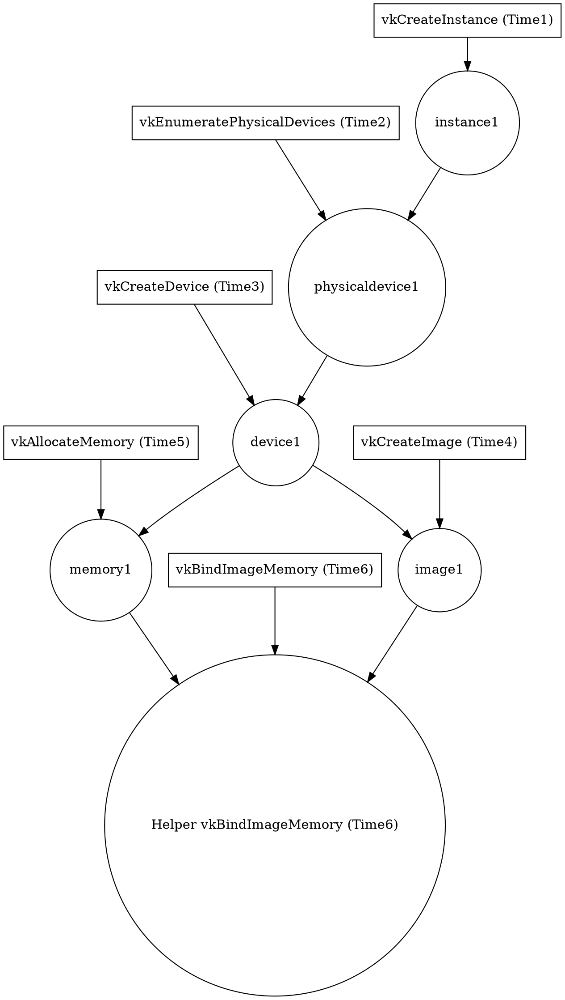
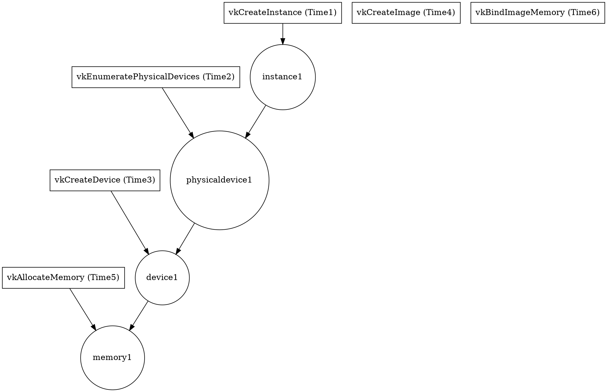
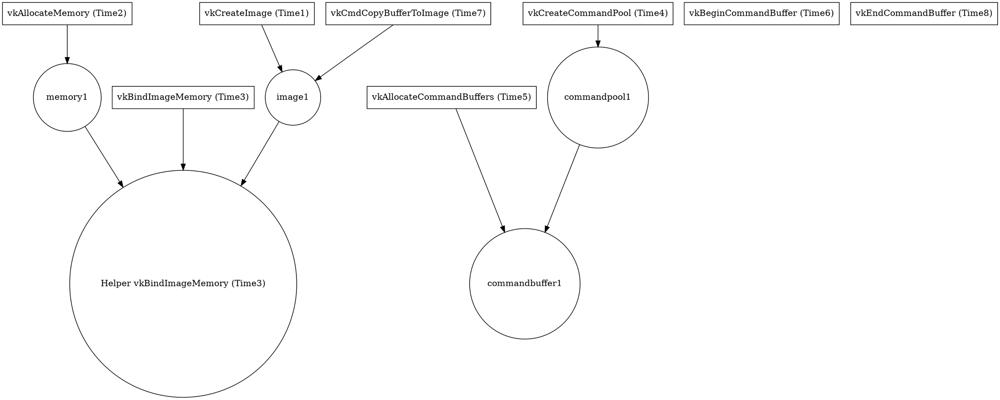

# Vulkan Snapshots

## Overview

Snapshots are used to save and load Vulkan state at a specific point in time.
Snapshots are useful for Virtual Devices that want to power off and then power
back on with the same device state.

Snapshotting is handled by tracking Vulkan API calls and their resulting objects
in a `DependencyGraph`. During snapshot saving, the nodes for API calls that
are present in the `DependencyGraph` are saved in chronological order. During
snapshot loading, the saved API calls are replayed which reconstructs the
original device state.

`DependencyGraph` has 2 types of nodes:

* `DependencyGraph::ApiNode` where each node represents a specific innovcation
of a Vulkan API function.

* `DependencyGraph::DepNode` where each node represents either:

  * A Vulkan object.

  * A marker for handling dependencies of specific commands.

## Object Creation:

```
// Time1
VkInstance instance1;
vkCreateInstace(..., &instance1);

// Time2
VkPhysicalDevice physicaldevice1;
vkEnumeratePhysicalDevices(..., &physicaldevice1);

// Time3
VkDevice device1;
vkCreateDevice(..., &device1);

...

// Time4
VkImage image1;
vkCreateImage(..., &image1);

// Time5
VkDeviceMemory memory1;
vkAllocateMemory(..., &memory1);

// Time6
vkBindImageMemory(image1, memory1);

...

// Time7
vkDestroyImage(image1);

// Time8
vkFreeMemory(memory1);
```

The `DependencyGraph` after `Time6` would look like:



where API calls nodes (boxes) are linked with the objects created and dependent
objects are linked with their parents.

When a `vkDestory*()` happens, nodes and all of their descendants are removed.
The `DependencyGraph` after `Time7` would look like:



TODO(bohu@ + natsu@): cleanup the `"vkCreateInstance (Time1)"` and
`"vkBindImageMemory (Time6)"` nodes.


## Command Buffers:

Ignoring instances, physical devices, and devices, suppose we have

```

// Time1
VkImage image1;
vkCreateImage(..., &image1);

// Time2
VkDeviceMemory memory1;
vkAllocateMemory(..., &memory1);

// Time3
vkBindImageMemory(image1, memory1);

...

// Time4
VkCommandPool commandpool1;
vkCreateCommandPool(..., &commandpool1);

// Time5
VkCommandBuffer commandbuffer1;
vkAllocateCommandBuffers(..., &commandpool1);

...

//// Rendering for Frame 1 ////

// Time6
vkBeginCommandBuffer(commandbuffer1);

// Time7
vkCmdCopyBufferToImage(commandbuffer1, ..., image1);

// Time8
vkEndCommandBuffer(commandbuffer1);

//// Rendering for Frame 2 ////

// Time9
vkResetCommandBuffer(commandbuffer1);

// Time10
vkBeginCommandBuffer(commandbuffer1);

// Time11
vkCmdCopyBufferToImage(commandbuffer1, ..., image1);

// Time12
vkEndCommandBuffer(commandbuffer1);
```

The `DependencyGraph` after `Time8` would look like:



Then, when the `vkResetCommandBuffer()` at `Time9` happens:
old command for commandbuffer1 is cleared.


